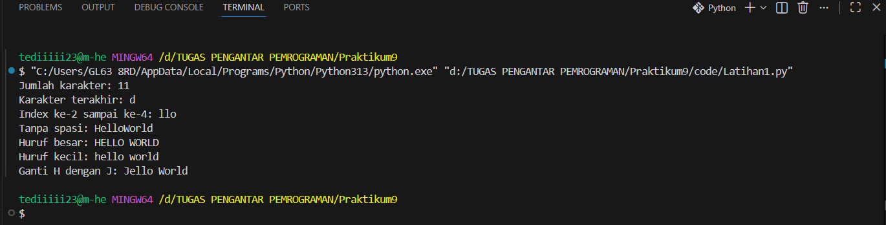
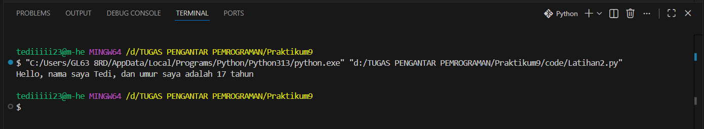
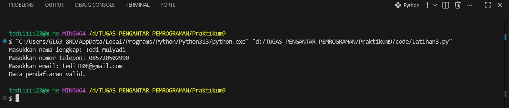

## Pertemuan14
|  |  |
| -------- | --- |
| **Nama** | Tedi Mulyadi |
| **NIM** | 312510163 |
| **Kelas** | TI.25.A2 |
| **Mata Kuliah** | Pengantar Pemrograman |
| **Dosen** | Agung Nugroho, S.Kom., M.Kom. |  
 
------------------------------------------------------------------------ 

### String Lanjutan
------------------------------------------------------------------------ 

What is Python String?  

- String adalah jenis yang paling populer di Python.
- Untuk membuatnya hanya dengan melampirkan karakter dalam tanda kutip.
- Python memperlakukan tanda kutip tunggal sama dengan tanda kutip ganda.
- Membuat string semudah memberi nilai pada sebuah variabel.  

### Latihan
``` python
txt = 'Hello World'
```
- Hitung jumlah karakternya
- Ambil karakter terakhir
- Ambil karakter index ke-2 sampai index ke-4 (llo)
- Hilangkan spasi pada text tersebut (HelloWorld)
- Ubah text menjadi huruf besar
- Ubah text menjadi huruf kecil
- Ganti karakter H dengan karakter J  
------------------------------------------------------------------------   

### Latihan 2  

Lengkapi kode tersebut
``` python
umur = 24
txt = 'Hello, nama saya john, dan umur saya adalah__tahun'
print(txt.format(umur))
```  
------------------------------------------------------------------------  
### Studi Kasus: Validasi Form Input
Sebuah aplikasi pendaftaran online memerlukanvalidasi input. Anda diminta membuat program untuk memvalidasi data berikut:  

- Nama lengkap(harushanyaberisihuruf).  

- Nomortelepon(harushanyaberisiangka).  

- Email (harusmengandungkarakter@dan . ).  

- Jika semuavalidasiberhasil, tampilkanpesan: Data pendaftaranvalid. Jika tidak, tampilkanpesanerror untuksetiapkesalahan.  
------------------------------------------------------------------------  

### Penjelasan Latihan  
- Membuat variabel txt yang berisi teks / string "Hello World".  
``` python
txt = 'Hello World'
```  

1. Hitung jumlah karakternya  
``` python
len(txt)
```  

- len() digunakan untuk menghitung jumlah karakter, termasuk spasi.
Output: 11  

2. Ambil karakter terakhir  
``` python
txt[-1]
```  

- Index -1 artinya mengambil karakter paling akhir dari string.
Output: **'d'**  

3. Ambil karakter index ke-2 sampai ke-4  
``` python
txt[2:5]
```  

Mengambil karakter mulai index 2 sampai 4 (karena angka 5 tidak ikut).
String "Hello World":

- H = 0  

- e = 1  

- l = 2  

- l = 3  

- o = 4  

Maka hasilnya adalah: "llo"  

4. Hilangkan spasi pada teks  
``` python  
txt.replace(" ", "")
```  

- replace(" ", "") artinya semua spasi diganti menjadi kosong.
Output: "HelloWorld"  

5. Ubah text menjadi huruf besar  
``` python
txt.upper()
```  

- Mengubah semua huruf menjadi kapital.
Output: "HELLO WORLD"  

6. Ubah text menjadi huruf kecil  
``` python
txt.lower()
```  

- Mengubah semua huruf menjadi huruf kecil.
Output: "hello world"  

7. Ganti karakter H dengan J  
``` python
txt.replace("H", "J")
```  

- Mengganti huruf H menjadi J.
Output: "Jello World"  

### Output  



### Penjelasan Latihan 2  
- Membuat variabel umur dengan nilai 24.  
``` python
umur = 17
```  
- Membuat template teks yang memiliki placeholder {} untuk diisi data nanti.  
``` python
txt = 'Hello, nama saya john, dan umur saya adalah {} tahun'
```  

- Format(umur) memasukkan nilai 24 ke dalam {}.  
``` python
print(txt.format(umur))
```  
Output menjadi:
``` python
Hello, nama saya Tedi, dan umur saya adalah 17 tahun
```  

### Output  



### Penjelasan Studi Kasus: Validasi Form Input  

1. Komentar Judul Program  
``` python
# Program Validasi Form Input
```  

Baris ini adalah **komentar**.  

Komentar tidak dijalankan oleh Python, fungsinya hanya untuk memberi keterangan bahwa program ini digunakan untuk validasi data input.  

2. Mengambil Input dari Pengguna  
``` python
nama = input("Masukkan nama lengkap: ")
telepon = input("Masukkan nomor telepon: ")
email = input("Masukkan email: ")
```

Penjelasan:  

- Input() digunakan untuk mengambil data dari pengguna  

- Data yang dimasukkan pengguna akan disimpan ke dalam variabel:  

&nbsp;&nbsp;&nbsp;&nbsp;Nama → menyimpan nama lengkap  

&nbsp;&nbsp;&nbsp;&nbsp;Telepon → menyimpan nomor telepon  

&nbsp;&nbsp;&nbsp;&nbsp;Email → menyimpan alamat email  

- Semua data dari input() bertipe **string (teks)**  

3. Variabel Penanda Validasi  
``` python
valid = True  
```

Penjelasan:  

- Variabel valid digunakan sebagai penanda  

- Nilai awal True berarti data dianggap benar  

- Jika ada kesalahan, nilai ini akan diubah menjadi False  

4. Validasi Nama Lengkap  
``` python
if not nama.replace(" ", "").isalpha():
    print("Error: Nama lengkap harus hanya berisi huruf.")
    valid = False
```  

Penjelasan langkah demi langkah:  

- nama.replace(" ", "") → menghapus spasi pada nama (misalnya: "Tedi Mulyadi" menjadi "TediMulyadi")  

- .isalpha() → mengecek apakah semua karakter adalah huruf  

- not → berarti jika tidak hanya huruf  

- Jika kondisi salah:

&nbsp;&nbsp;&nbsp;&nbsp;Program menampilkan pesan error  

&nbsp;&nbsp;&nbsp;&nbsp;valid diubah menjadi False

5. Validasi Nomor Telepon  
``` python
if not telepon.isdigit():
    print("Error: Nomor telepon harus hanya berisi angka.")
    valid = False
```

Penjelasan:

- .isdigit() mengecek apakah isi variabel hanya angka  

- Jika nomor telepon mengandung huruf atau simbol:  

&nbsp;&nbsp;&nbsp;&nbsp;Pesan error ditampilkan  

&nbsp;&nbsp;&nbsp;&nbsp;Status valid menjadi False  

6. Validasi Email  
``` python
if "@" not in email or "." not in email:
    print("Error: Email harus mengandung karakter '@' dan '.'.")
    valid = False
```

Penjelasan:  

- "@" not in email → mengecek apakah email tidak mengandung @  

- "." not in email → mengecek apakah email tidak mengandung titik  

- or artinya:  

- Jika salah satu tidak ada → email dianggap tidak valid

- Jika salah:  

- Pesan error ditampilkan  

- valid diubah menjadi False  

7. Menampilkan Hasil Akhir
if valid:  
``` python
    print("Data pendaftaran valid.")
```  

Penjelasan:  

- Program mengecek nilai valid  

- Jika valid == True:  

&nbsp;&nbsp;&nbsp;&nbsp;Artinya semua input lolos validasi  

&nbsp;&nbsp;&nbsp;&nbsp;Program menampilkan pesan "Data pendaftaran valid."  

- Jika valid == False:  

&nbsp;&nbsp;&nbsp;&nbsp;Pesan ini tidak ditampilkan  

### Output  

  

### Kesimpulan  

Program ini bekerja dengan cara:  

1. Menerima input dari pengguna  

2. Memeriksa setiap data sesuai aturan  

3. Menampilkan pesan error jika ada kesalahan  

4. Menampilkan pesan sukses jika semua data benar  

Program ini cocok digunakan sebagai dasar validasi form pendaftaran online.